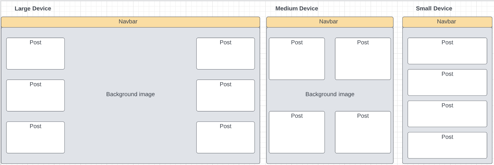

# Fake or Fact

_Note: add responsive screenshot_

## Project Description
_Note: add description_

## Table of Contents
-   Project Description
-   Project Planning
-   Testing
    -   Validator Testing
    -   Bugs
-   Features
-   
-   Technologies Used
-   Credits

## Project Planning
1. Create inital user stories <!--Complete-->
2. Initial design wireframes

3. Install Django and supporting libraries <!--Complete-->
4. Create Django Project (fakefact) and app (...) <!--Complete-->
5. Create and Deploy App in Heroku <!--Complete-->
6. Create Model (Post) <!--Complete-->
    -   featured_image
    -   title
    -   status
    -   author
    -   created
    -   fake
    -   fact
    -   content - revealed once user vore fake or fact
7. Set up Django Admin Panel <!--Compelete-->
    -   User Stories completed
        -   [USER STORY: Create draft posts](https://github.com/AEMacBeath/fake-fact/issues/4)
        -   [USER STORY: Publish posts](https://github.com/AEMacBeath/fake-fact/issues/5)
        -   [USER STORY: Edit posts](https://github.com/AEMacBeath/fake-fact/issues/6)
        -   [USER STORY: Delete posts](https://github.com/AEMacBeath/fake-fact/issues/7)
8. Create templates to render view <!--Compelete-->
    -   Install [Bootstrap](https://getbootstrap.com/docs/5.2/getting-started/introduction/)
    -   Add html files
    -   Link up urls
9. Create main view <!--Compelete-->
    -   Navbar
    -   Background image
    -   Footer
    -   Cards for posts using [Bootstrap](https://getbootstrap.com/docs/5.2/components/card/) <!--Complete-->
    -   User Stories completed
        -   [USER STORY: View posts](https://github.com/AEMacBeath/fake-fact/issues/1)
10. Authorisation <!--ongoing-->

## Credits
-   CI I think before i blog 
-   Bootstrap documentation
-   Wireframes created on [Lucid](https://lucid.app/)