# Fake or Fact
## Deployed app - [fakefact2022](https://fakefact2022.herokuapp.com/)

## Responsive screenshot

## Project Description
Fake | Fact is a blog web applcaition where users are presented with vaiours facts and myths. The user can select wether they think it is fake or fact. Once chosen they are presented with the full post details. If logged in the users can also create and view messages left by other users. 

## Table of Contents
-   [Project Description](#project-description)
-   [Project Planning](docs/planning.md)
-   [Features](#features)
    -   [Common features](#common-features)
    -   [Homepage](#homepage)
    -   [Post detail](#post-detail)
    -   [Account screens](#account-screen)
-   [Testing](#testing)
    -   [Validator Testing](#validator-testing)
    -   [Bugs](#bugs)
-   [Technologies Used](#technologies-user)
-   [Credits](#credits)

## Features
### Homepage
-   Background image
-   Navigation - [Bootstrap Navbar](https://getbootstrap.com/docs/5.2/components/navbar/)
-   Post title cards with Fake and Fact buttons - [Bootrap Cards](https://getbootstrap.com/docs/5.2/components/card/)
-   Pagination buttons

#### Homepage Wireframe
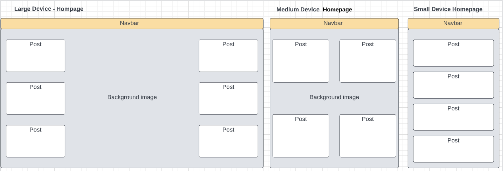

#### Hompage Screenshot
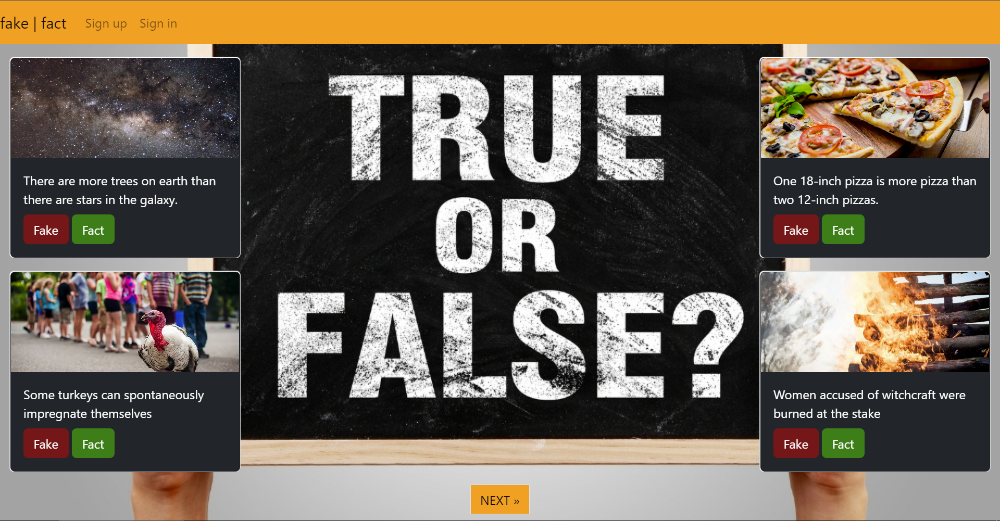

### Post Detail
-   Post content [Bootrap Cards](https://getbootstrap.com/docs/5.2/components/card/)
-   Accepted user comments
-   Users own comments
-   MessageForm [Bootrap Card](https://getbootstrap.com/docs/5.2/components/card/)

#### Post Detail Wireframe
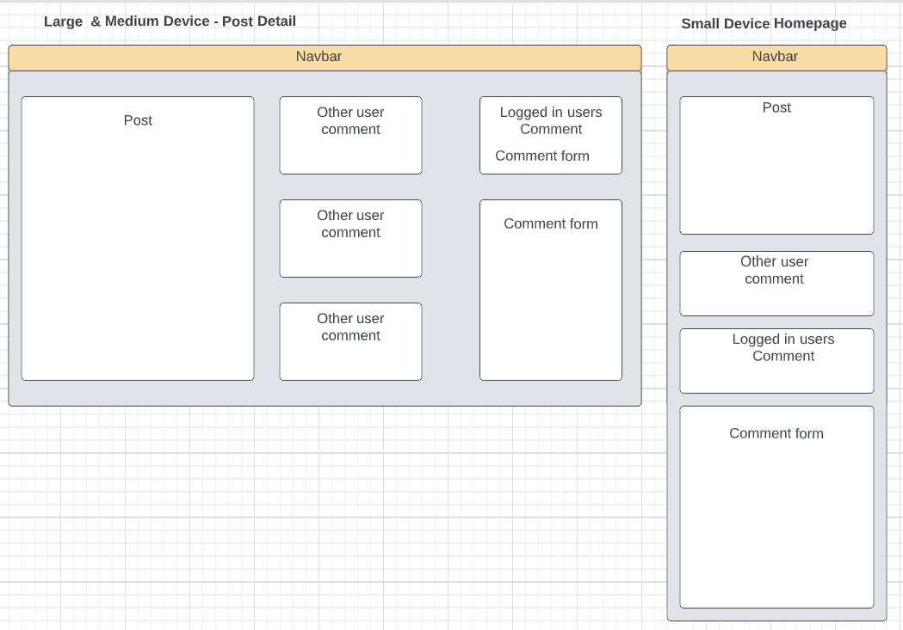

#### Post Detail (Signed out) Screenshot

#### Post Detail (Signed in) Screenshot
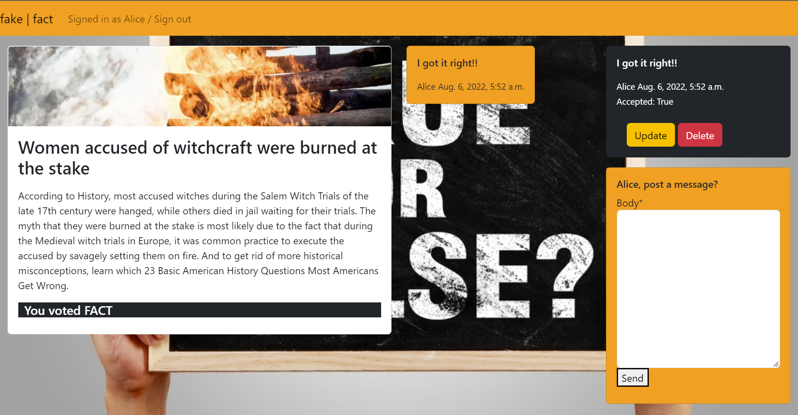

### Account screens
-   Extends base.html
-   Each screen contains a [Bootrap Card](https://getbootstrap.com/docs/5.2/components/card/) for the form.

#### Sign up Screenshot

#### Sign in Screenshot

#### Sign out Screenshot

### Update Message
-   Extends base.html
-   Contains a [Bootrap Card](https://getbootstrap.com/docs/5.2/components/card/) for the form.
-   Pre-populated form body with existing message

#### Update Message Screenshot

#### Delete Message Screenshot

## Testing

### Manual testing
#### User Account (signup, signout, signin) 
1. Sign up nav link and Sign up button on post detail page - opens /accounts/signup
2. Complete and submit form - returns to homepage
3. Sign out nav link - opens /accounts/logout
4. Sign out button - returns to homepage
5. Sign in nav link and Sign in button on post detail page - opens /accounts/login
6. Complete and submit form - returns to homepage

#### Fake / Fact buttons
1. Fake button on each post
    -   opens detail and messages for that post
    -   displayes You voted Fake at the bottom of the post detail card
2. Fact button on each post
    -   opens detail and messages for that post
    -   displayes You voted Fact at the bottom of the post detail card

#### Pagination
1. Next button - goes to next page of posts
2. Prev button - returns to previous page of postss

#### Messages
1. Complete and submit form on post detial page - reloads page with success banner
2. Update button on users own comment - update and submit form - returns to post detail page
3. Delete button on users own comment - opens confirmation screen - Delete button returns to post detail page

### Validator testing
-   [HTML - w3](https://validator.w3.org/nu/?doc=https%3A%2F%2Ffakefact2022.herokuapp.com%2F)
-   [CSS - Jigsaw](https://jigsaw.w3.org/css-validator/validator?uri=https%3A%2F%2Ffakefact2022.herokuapp.com%2F&profile=css3svg&usermedium=all&warning=1&vextwarning=&lang=en)
    -   /dist/css/bootstrap.min.css parse errors only
-   [Python - PEP8](docs/pep8_screenshots.md)

#### blog/admin.py
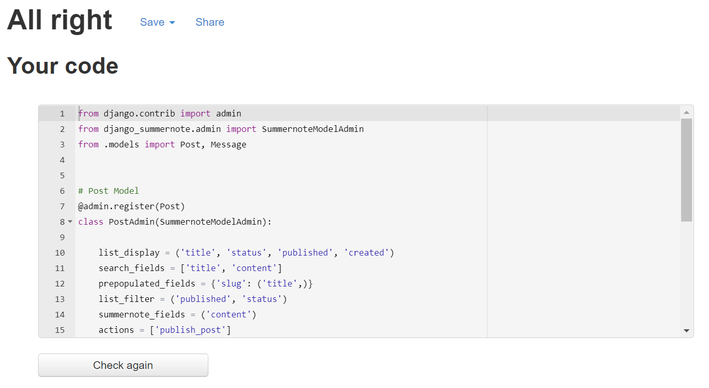

#### blog/forms.py
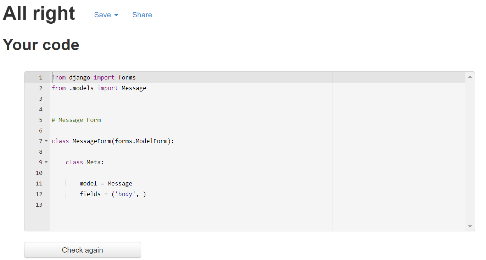

#### blog/models.py
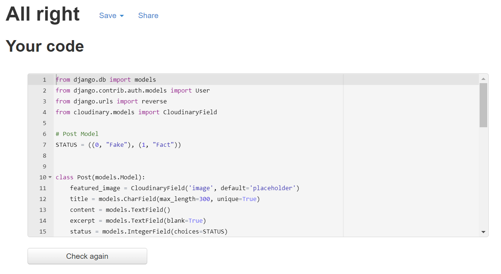

#### blog/urls.py
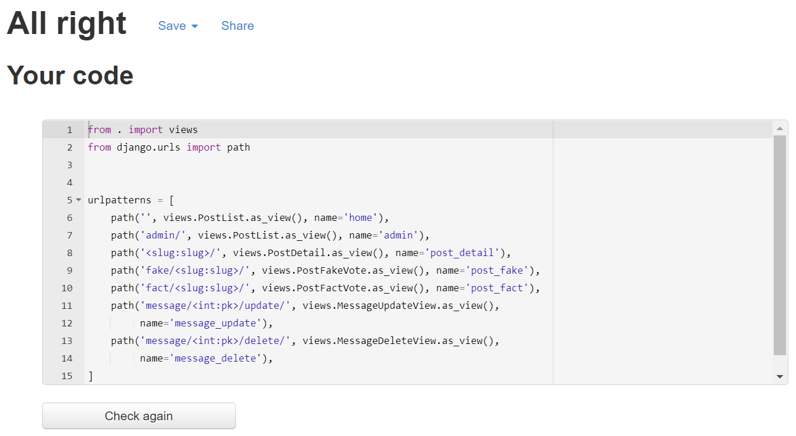

#### blog/views.py
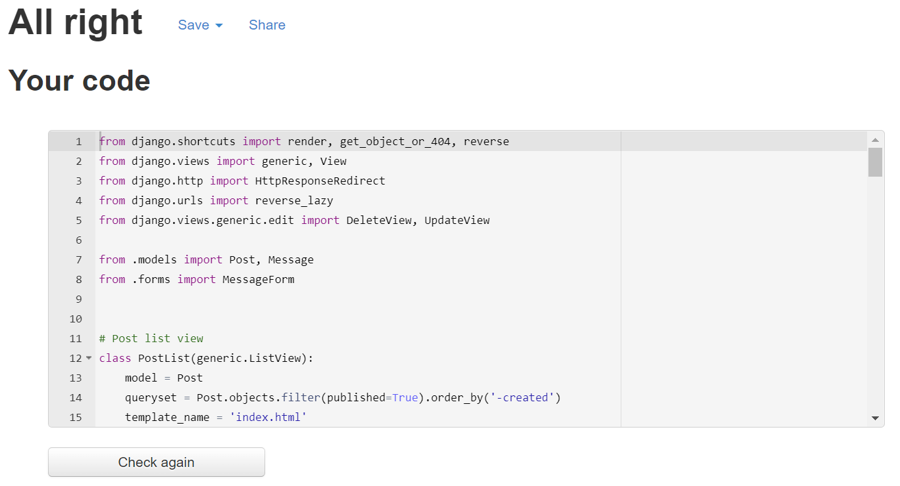

#### fakefact/settings.py
Line 145 too long. Can't break STATIC_STORAGE url to fix.
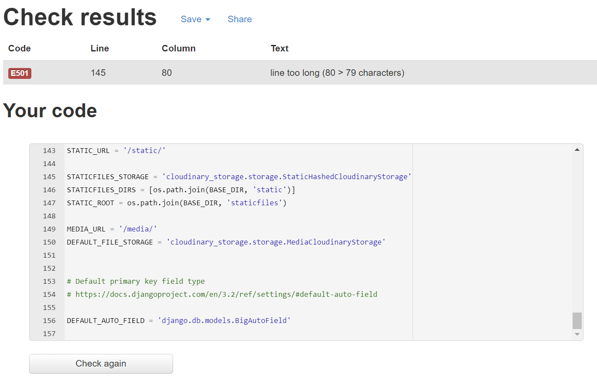

#### fakefact/urls.py
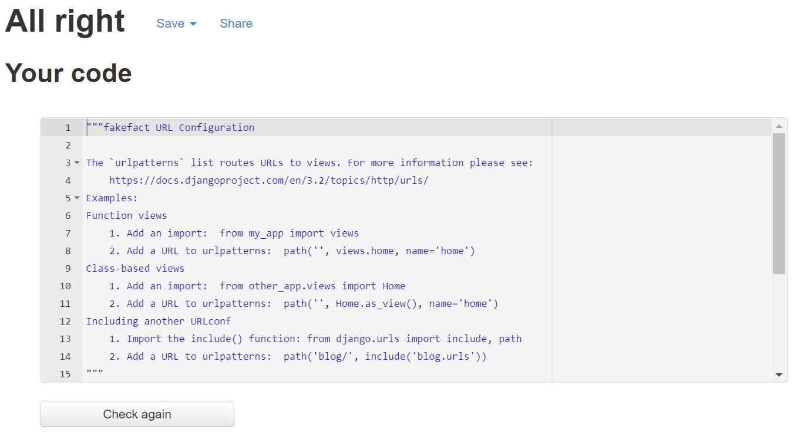

## Credits
-   Code Institute - I think before i blog walkthrough use for initial setup
-   [Bootstrap documentation](https://getbootstrap.com/)
-   Wireframes created on [Lucid](https://lucid.app/)
-   Post content
    -   Fact posts from [bestlifeonline](https://bestlifeonline.com/common-myths/)
    -   Fake posts from [Insider](https://www.insider.com/true-facts-that-sound-fake-2017-8#the-guinness-book-of-world-records-was-created-to-settle-bar-arguments-4)
-   [thisdavej.com](https://thisdavej.com/copy-table-in-excel-and-paste-as-a-markdown-table/) Excel to Markdown converter used to input model diagrams in panning.md